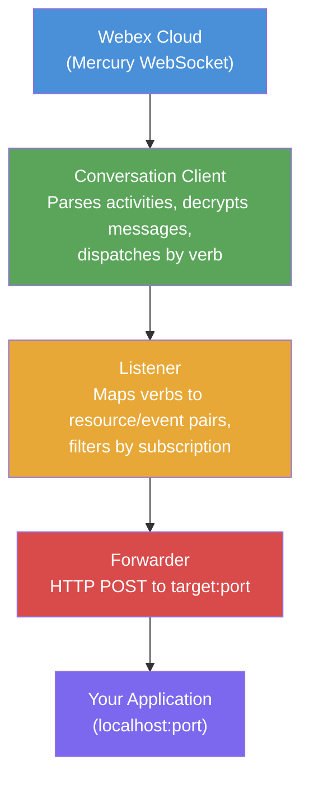
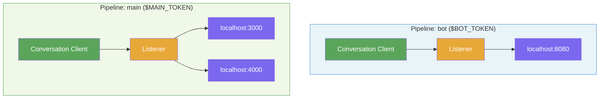

# Webex Go Hookbuster

[](https://github.com/tejzpr/webex-go-hookbuster/actions/workflows/ci.yml)
[](https://goreportcard.com/report/github.com/tejzpr/webex-go-hookbuster)
[](https://pkg.go.dev/github.com/tejzpr/webex-go-hookbuster)
[](https://opensource.org/licenses/MPL-2.0)
[](https://hub.docker.com/r/tejzpr/webex-go-hookbuster)

A WebSocket-to-HTTP event bridge for Webex, written in Go using the [webex-go-sdk](https://github.com/WebexCommunity/webex-go-sdk).

Hookbuster connects to the Webex Mercury WebSocket service and forwards real-time events as HTTP POST requests to a local target application — eliminating the need for public webhook URLs during development.

## Features

- **Real-time event forwarding** via Webex Mercury WebSocket
- **Supported resources**: rooms, messages, memberships, attachmentActions
- **Interactive CLI** for guided setup
- **Environment variable mode** for automated / container deployments
- **Multi-pipeline mode** via YAML config file — multiple tokens and/or fan-out to multiple webhooks
- **Firehose mode** subscribes to all resources and all events
- **Graceful shutdown** on SIGINT / SIGTERM
- **End-to-end decryption** of message content via the SDK's KMS integration

## Supported Resources & Events

| Resource          | Events                        |
| ----------------- | ----------------------------- |
| rooms             | created, updated              |
| messages          | created, deleted              |
| memberships       | created, updated, deleted     |
| attachmentActions | created                       |

## Quick Start

### Prerequisites

- Go 1.24+
- A Webex access token (get one at https://developer.webex.com)

### Build

```bash
go build -o hookbuster .
```

### Run — Interactive Mode

```bash
./hookbuster
```

You will be prompted for:
1. Webex access token
2. Forwarding target (e.g. `localhost`)
3. Forwarding port (e.g. `8080`)
4. Resource selection
5. Event selection

### Run — Environment Variable Mode

```bash
TOKEN=<your-webex-token> PORT=8080 TARGET=localhost ./hookbuster
```

When `TOKEN` and `PORT` are set, hookbuster automatically subscribes to **all** resources with **all** events (firehose mode).

| Variable | Required | Default     | Description                    |
| -------- | -------- | ----------- | ------------------------------ |
| `TOKEN`  | Yes      | —           | Webex access token             |
| `PORT`   | Yes      | —           | Target forwarding port         |
| `TARGET` | No       | `localhost` | Target hostname or IP address  |

### Run — Multi-Pipeline Mode (Config File)

Create a `hookbuster.yml` config file (see `hookbuster.yml.example`):

```yaml
pipelines:
  - name: "bot-account"
    token_env: "WEBEX_TOKEN_BOT"       # env var name (token never in file)
    resources: ["messages", "rooms"]
    events: "all"
    targets:
      - url: "http://localhost:8080"

  - name: "main-account"
    token_env: "WEBEX_TOKEN_MAIN"
    resources: ["messages", "rooms", "memberships", "attachmentActions"]
    events: "all"
    targets:                            # fan-out to multiple targets
      - url: "http://localhost:3000"
      - url: "http://localhost:4000"
```

Then run with the `-c` flag or `HOOKBUSTER_CONFIG` environment variable:

```bash
# Via flag
./hookbuster -c hookbuster.yml

# Via environment variable
HOOKBUSTER_CONFIG=hookbuster.yml ./hookbuster
```

**Key features:**

- **Multi-token**: Each pipeline connects with its own Webex token
- **Fan-out**: A single pipeline can forward events to multiple webhook targets simultaneously
- **Security**: Tokens are referenced by env var name — never stored in the config file
- **Firehose shorthand**: Omit `resources` to subscribe to all resources

| Config Field | Required | Default | Description                            |
| ------------ | -------- | ------- | -------------------------------------- |
| `name`       | No       | —       | Pipeline name (used in log output)     |
| `token_env`  | Yes      | —       | Env var name holding the Webex token   |
| `resources`  | No       | all     | Resources to subscribe to              |
| `events`     | No       | `all`   | Event filter (`all` or specific event) |
| `targets`    | Yes      | —       | One or more target URLs                |

### Docker

Build and run from the parent directory (which contains both `webex-go-sdk/` and `webex-go-hookbuster/`):

```bash
docker build -f webex-go-hookbuster/Dockerfile -t hookbuster .
docker run -e TOKEN=<your-token> -e PORT=8080 -e TARGET=host.docker.internal hookbuster
```

## How It Works

### Single Pipeline (Interactive / Env Var Mode)



### Multi-Pipeline (Config File Mode)



## License

MPL-2.0
